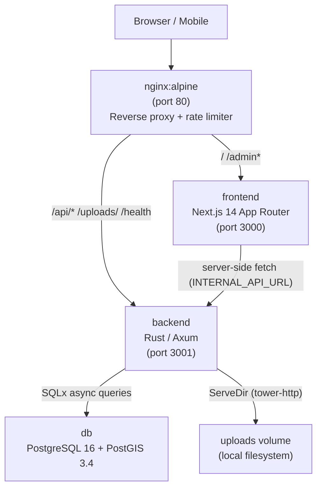

<!-- generated-by: gsd-doc-writer -->
# Architecture

## System Overview

Bengaluru Walkability Public Audit is a civic-tech web application that lets citizens photograph and geolocate substandard pedestrian infrastructure in Bengaluru. The system follows a layered, containerised architecture: a Next.js 14 (App Router) frontend handles citizen-facing photo submission and an interactive map; a Rust/Axum REST API manages submission validation, EXIF stripping, image storage, and geospatial ward lookup via PostGIS; and nginx acts as the single public entry point, routing and rate-limiting all traffic before it reaches the backend or frontend containers. PostgreSQL 16 with PostGIS 3.4 provides persistent geospatial storage. All four services run under Docker Compose with explicit health-check gates so each upstream service is genuinely ready before the next one starts.

## Component Diagram



## Data Flow

The following describes the critical citizen report submission path:

1. **Photo selection** — The citizen picks or captures a photo in the browser. The `PhotoCapture` component (`frontend/app/components/PhotoCapture.tsx`) reads the raw file and, if the image is over 10 MB, compresses it client-side via canvas before proceeding.
2. **Client-side EXIF extraction** — The `exifr` library runs in the browser to extract GPS coordinates from EXIF metadata. Raw coordinates are never sent to the server; they are used only to pre-fill the map pin.
3. **Location confirmation** — The citizen confirms or adjusts the pin on a Leaflet map rendered by `LocationMap` (`frontend/app/components/LocationMap.tsx`), a `dynamic()` import with `ssr: false` to avoid the Leaflet `window` dependency at SSR time.
4. **Multipart form submission** — The report page (`frontend/app/report/page.tsx`) POSTs a `multipart/form-data` payload to `/api/reports` via `API_BASE_URL` from `frontend/app/lib/config.ts`. In Docker, this resolves to a relative URL that nginx proxies to the backend.
5. **nginx ingress** — nginx applies the `upload` rate-limit zone (5 POST/min per IP) and proxies the request to `backend:3001`, setting `X-Real-IP` and `X-Request-ID` headers.
6. **Backend handler** (`backend/src/handlers/reports.rs`) — The `create_report` handler:
   a. Reads all multipart fields, including the hidden honeypot `website` field.
   b. Silently returns a fake success response if the honeypot is non-empty (ABUSE-02 bot detection).
   c. Computes a SHA-256 hash of the raw image bytes and rejects exact duplicates with a fake success response (ABUSE-03).
   d. Validates coordinates against the Bengaluru bounding box (lat 12.7342–13.1739, lng 77.3791–77.8731).
   e. Checks the per-IP+geohash-6 rate limiter (2 submissions/hour per ~1 km cell) using the `governor` crate (ABUSE-01).
   f. Strips all EXIF metadata from the image using `img-parts` before writing to disk.
   g. Writes the clean JPEG to the `uploads` Docker volume.
   h. Performs a PostGIS `ST_Within` query to assign the submission to a BBMP ward polygon.
   i. Inserts the report row; a database trigger (`trg_set_report_location`) auto-populates the `GEOGRAPHY(POINT, 4326)` column from the lat/lng values.
7. **Background deduplication** — A tokio task (`backend/src/db/dedup_job.rs`) polls every 5 minutes for unlinked reports within 50 m of an open report of the same category and links them via `duplicate_of_id`, incrementing `duplicate_count` and setting `duplicate_confidence` to `high` when two distinct submitter IPs are seen.
8. **Map display** — The public map (`frontend/app/map/`) fetches paginated reports from `/api/reports` and renders them on a Leaflet map via `react-leaflet`.

Admin authentication flow:

1. Admin POSTs credentials to `/api/admin/auth/login`. nginx applies a stricter 5-req/min rate limit on this exact-match location.
2. The backend verifies the password with Argon2id, issues a signed HS256 JWT, and sets it as an `HttpOnly` cookie (`admin_token`).
3. Subsequent admin requests carry the cookie. The `require_auth` middleware (`backend/src/middleware/auth.rs`) decodes and validates the JWT, rejecting `alg:none` tokens and expired tokens. Decoded `JwtClaims` are inserted into request extensions for downstream handlers.
4. Role gating (`require_role`) enforces that `admin` is a superset of all roles and `reviewer` cannot access admin-only routes.

## Key Abstractions

| Abstraction | File | Description |
|---|---|---|
| `AppState` | `backend/src/main.rs` | Axum shared state: DB pool, uploads dir, JWT secret, session hours, rate limiter |
| `AppError` | `backend/src/errors.rs` | Unified error enum mapping to HTTP status codes (400, 401, 403, 404, 409, 429, 500) |
| `Config` | `backend/src/config.rs` | Reads `DATABASE_URL`, `UPLOADS_DIR`, `PORT`, `CORS_ORIGIN`, `PUBLIC_URL` from environment |
| `Report` / `ReportResponse` | `backend/src/models/report.rs` | DB row and public JSON shape; `into_response()` rounds lat/lng to 3 dp and excludes submitter PII |
| `JwtClaims` | `backend/src/middleware/auth.rs` | JWT payload: `sub`, `email`, `role`, `exp`. Only HS256 accepted |
| `Organization` | `backend/src/models/organization.rs` | Self-referential org hierarchy (GBA → corporation → ward_office) |
| `create_report` handler | `backend/src/handlers/reports.rs` | Core submission handler: honeypot, photo-hash dedup, bbox validation, rate limit, EXIF strip, ward lookup |
| `API_BASE_URL` / `INTERNAL_API_URL` | `frontend/app/lib/config.ts` | Centralised URL config; `NEXT_PUBLIC_API_URL` baked at build time for client, `INTERNAL_API_URL` used server-side only |
| `LocationMap` | `frontend/app/components/LocationMap.tsx` | Leaflet map with draggable marker; always loaded via `dynamic(..., { ssr: false })` |
| `dedup_job` | `backend/src/db/dedup_job.rs` | Background tokio loop: 5-minute poll, PostGIS `ST_DWithin` (50 m radius), atomic link + count increment |

## Directory Structure Rationale

```
bengaluru-walkability-public-audit/
├── backend/                  Rust/Axum API — all server-side logic, DB access, image processing
│   ├── src/
│   │   ├── config.rs         Environment variable loading (Config struct)
│   │   ├── errors.rs         Unified AppError → HTTP status mapping
│   │   ├── main.rs           Router assembly, middleware wiring, AppState construction
│   │   ├── db/               Database layer (queries, admin seed, dedup background job)
│   │   ├── handlers/         Axum route handlers (reports, admin, wards, health)
│   │   ├── middleware/        JWT auth middleware and role helpers
│   │   ├── migrations_tests/ Compile-time migration validation tests
│   │   └── models/           SQLx FromRow structs and JSON response shapes
│   └── migrations/           SQL migration files applied in order at startup
│       ├── 001_init.sql      reports table, PostGIS enums, triggers, spatial indexes
│       ├── 002_admin.sql     admin_users table, user_role enum, status_history actor
│       ├── 003_super_admin.sql  is_super_admin flag on admin_users
│       ├── 004_ward_boundaries.sql  wards table with BBMP polygon data (3.5 MB KML import)
│       ├── 005_organizations.sql   organizations hierarchy table, admin_users.org_id
│       ├── 006_ward_org_scoping.sql  wards.org_id for ward-office scoped admins
│       └── 007_anti_abuse.sql  photo_hash, duplicate_of_id, submitter_ip columns
├── frontend/                 Next.js 14 App Router — citizen UI and admin dashboard
│   └── app/
│       ├── lib/              Centralised config, constants, translations, utilities
│       ├── components/       Shared UI components (PhotoCapture, LocationMap, ReportsMap, etc.)
│       ├── report/           Citizen report submission flow (multi-step form)
│       ├── map/              Public map view with all submitted reports
│       └── admin/            Password-protected admin dashboard (reports, users, stats)
├── nginx/
│   └── nginx.conf            Reverse proxy, rate-limit zones, CSP headers, upstream definitions
├── docker-compose.yml        Production service definitions with health-check gates and memory limits
├── docker-compose.dev.yml    Dev overrides (volume mounts for hot reload)
└── data/                     GeoJSON ward boundary source files (gba_wards_2025.geojson); the KML source (gba-369-wards-december-2025.kml) lives at the project root
```

## Notable Design Decisions

**EXIF GPS client-side only.** `exifr` runs in the browser; the extracted GPS coordinates pre-fill the map but are never transmitted raw to the server. The backend additionally strips all EXIF metadata from the saved JPEG using `img-parts` as a belt-and-suspenders privacy measure.

**SQLx compile-time query checks.** All SQL queries are verified against a live database at compile time. Offline builds use captured metadata from `cargo sqlx prepare`. Any schema drift causes a compile error rather than a runtime panic.

**Leaflet SSR caveat.** Leaflet depends on `window`, which is absent during Next.js server rendering. Every map component (`LocationMap`, `ReportsMap`) is loaded with `dynamic(() => import(...), { ssr: false })`.

**Relative URLs in Docker.** `NEXT_PUBLIC_API_URL` is set to `""` at Docker build time so the compiled bundle uses relative paths (`/api/...`). nginx then proxies these to `backend:3001`. This means the same image works across localhost, LAN, and production domains without a rebuild.

**Anti-abuse layering.** Three independent abuse controls operate in sequence: nginx rate-limits by IP at the proxy layer; the backend honeypot check discards bot submissions before any I/O; the photo-hash dedup check rejects exact re-uploads before rate-limit quota is consumed; and the per-IP+geohash-6 token-bucket limiter (governor crate) caps genuine submissions to 2/hour per ~1 km cell.

**Memory-capped containers.** Each service has an explicit Docker `memory` limit: nginx 64 MB, backend 256 MB, frontend 256 MB, database 512 MB. The Rust binary's low baseline footprint makes the backend limit comfortably achievable.

**Geography trigger.** The `trg_set_report_location` trigger on the `reports` table auto-populates the `GEOGRAPHY(POINT, 4326)` column from `latitude` and `longitude` on every insert or update. Application code never sets the `location` column directly.

## Supplementary Design Notes

**Ward lookup endpoint.** `GET /api/wards/lookup?lat={lat}&lng={lng}` is a public, no-auth endpoint handled by `backend/src/handlers/wards.rs`. It runs a PostGIS `ST_Within` point-in-polygon query and returns the matching `ward_number` and `ward_name`, or 404 when the coordinate falls outside all BBMP ward polygons. The frontend report page (`frontend/app/report/page.tsx`) calls this endpoint after the user confirms their map pin so the submission form can display the ward label before the report is submitted.

**Org-scoped report visibility.** Admin users can be assigned an `org_id` (via `PATCH /api/admin/users/:id/org`). When `org_id` is set, `list_admin_reports` and `count_admin_reports` in `backend/src/db/admin_queries.rs` append a `WITH RECURSIVE org_subtree` CTE that walks the `organizations` parent-child tree downward from the assigned org and then joins to `wards.org_id` to restrict the result to reports whose ward falls within that org's subtree. Super-admins and users with `org_id = NULL` see all reports unfiltered. This mechanism is implemented entirely in SQL (no application-layer filtering) so pagination totals remain accurate.

**Next.js admin API rewrite (staging/Vercel proxy).** `next.config.mjs` defines a `rewrites()` rule that proxies `/api/admin/:path*` through the Next.js server to `INTERNAL_API_URL/api/admin/:path*`. This allows the backend's `Set-Cookie: admin_token` response to be scoped to the Vercel (or custom) domain so Next.js middleware can read the `admin_token` cookie for server-side auth guards. The rewrite deliberately excludes `POST /api/reports` because Vercel enforces a 4.5 MB request body limit while the app supports photo uploads up to 20 MB; those submissions call the backend directly via `NEXT_PUBLIC_API_URL`. In Docker, nginx handles all proxying and the rewrite rule has no effect.

## Frontend Design System

The citizen-facing UI (Phase 02.3.1) uses a bespoke CSS custom-property token system defined in `frontend/app/globals.css`. No component library is used; all UI primitives are hand-written in `frontend/app/components/ui/`.

**Token system.** CSS custom properties define a warm neutral palette (`--bg`, `--surface`, `--ink`, `--muted`), a single civic accent colour in OKLCH (`--accent` at `oklch(0.62 0.14 145)`, a muted green), and semantic danger/warn colours sharing the same chroma and lightness with only hue varying. Radii (`--r-sm` through `--r-full`) and warm-toned shadows (`--shadow-sm/md/lg`) are also defined as tokens. Admin pages inherit the same token set, replacing the previous Tailwind system stack.

**Typography.** Three font families are loaded via `next/font/google` in `frontend/app/layout.tsx` and exposed as CSS variables: Inter (`--font-inter`, weights 400–700), JetBrains Mono (`--font-jetbrains-mono`, for monospaced numeric content), and Noto Sans Kannada (`--font-noto-sans-kannada`, for Kannada script). The `--font-sans`, `--font-mono`, and `--font-kn` aliases compose these into the design system.

**Bilingual layer.** `frontend/app/lib/translations.ts` exports a static `t` map of all UI strings keyed by token, each providing `{ en, kn }` values. The `Bi` component (`frontend/app/components/ui/Bi.tsx`) renders English text above Kannada in a stacked flexbox span; Kannada is sized at 0.72em with reduced opacity so it reads as a subtitle rather than equal weight. All citizen-facing strings are passed through `Bi` rather than hardcoded.

**UI primitives.** Four stateless components cover the full interaction vocabulary:
- `Btn` — four variants (`primary`, `accent`, `secondary`, `ghost`) × four sizes (`sm`, `md`, `lg`, `xl`); merges token-based style objects at render time; applies the `.press` CSS transition class for tactile feedback.
- `Pill` — five tones (`neutral`, `accent`, `ink`, `glass`, `warn`); used for status labels and count badges.
- `Icon` — inline SVG system with 32 named icons covering navigation, UI actions, and eight report categories (`cat_no_path`, `cat_broken`, `cat_blocked`, `cat_crossing`, `cat_lighting`, `cat_other`, `cat_ramp`, `cat_encroach`). Icons are rendered as `<svg viewBox="0 0 24 24">` with stroke-based paths; no external sprite file or icon font is used.
- `SectionLabel` — small all-caps monospace label for section headings.

**Report wizard.** The report submission page (`frontend/app/report/page.tsx`) implements a three-step wizard with steps typed as `"photo" | "category" | "confirm"`. Step 2 uses `CategoryGrid` (6-item 2-column radio grid) and `SeverityGrid` (3-item row: low/medium/high) from `frontend/app/components/redesign/`. The success state is handled by `SuccessCard` (same directory), which displays the report UUID, ward label, and share/copy actions without a page navigation.

**Homepage photo entry point.** `ReportCTA` (`frontend/app/components/ReportCTA.tsx`) is the primary citizen entry point on the homepage. It presents two photo input paths: a primary camera-capture button (`<input capture="environment">`) and a secondary gallery-upload link (no `capture` attribute). Both paths run EXIF extraction on the original file, optionally compress it via canvas if over 10 MB, then call `storePendingPhoto()` to write the prepared `PendingPhoto` object to `window.__pendingPhoto` before navigating to `/report`. This window-level hand-off (`frontend/app/lib/photo-store.ts`) is used instead of React state or URL params because Next.js App Router code-splitting does not share module-level variables across chunk boundaries.

**Three URL constants.** `frontend/app/lib/config.ts` exports three URL constants: `API_BASE_URL` (public endpoint calls, equals `NEXT_PUBLIC_API_URL` or `""`), `ADMIN_API_BASE_URL` (always `""` — all admin calls use relative paths so the auth cookie is always scoped to the current origin), and `INTERNAL_API_URL` (server-side only, used by server components and Next.js rewrites to reach the backend container directly).

## PWA Configuration

The frontend ships a Web App Manifest at `frontend/public/manifest.json`, making the app installable as a standalone Progressive Web App on mobile browsers. Key manifest fields:

- `display: "standalone"` — hides browser chrome when launched from the home screen.
- `orientation: "portrait"` — locks orientation to portrait, matching the mobile-first submission flow.
- `theme_color: "#16a34a"` — matches the civic green accent used in the design system.
- `start_url: "/"` — launches to the citizen homepage.
- Icons at 192×192 and 512×512 are referenced in the manifest (`/icon-192.png`, `/icon-512.png`) but the PNG files have not yet been created in `frontend/public/`.

The root layout (`frontend/app/layout.tsx`) includes `<link rel="manifest">`, `apple-mobile-web-app-capable`, and `apple-mobile-web-app-status-bar-style` meta tags. The `viewport` export omits `maximumScale` deliberately to allow browser zoom per WCAG 1.4.4.
